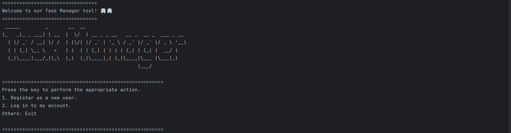

# Task Manager CLI

Welcome to the **Task Manager CLI**! 🎉

This application allows you to manage tasks directly from your terminal. Whether you're looking to **create**, **update**, or **delete** tasks, this CLI tool provides an easy-to-use interface to help you organize your tasks effectively.

## Features

- **User Registration and Login**: Create a new account and log in to access your personalized task list.
- **Task Management**: Add, update, and delete tasks with ease.
- **Task Status Updates**: Mark tasks as "done" or "pending" to keep track of your progress.
- **Simple and Intuitive**: Designed with simplicity in mind, so you can focus on getting things done.
